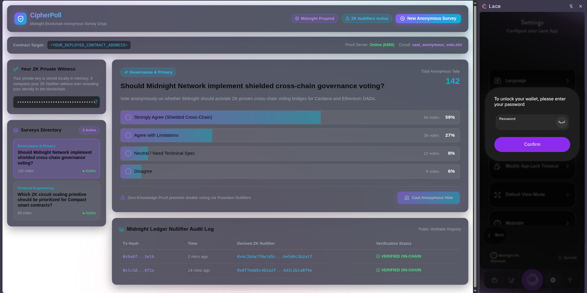
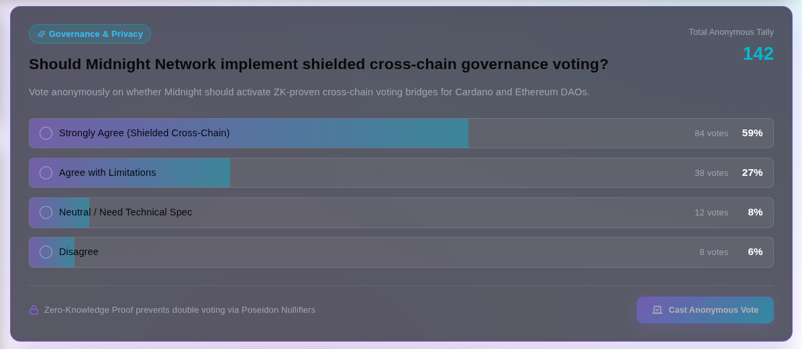
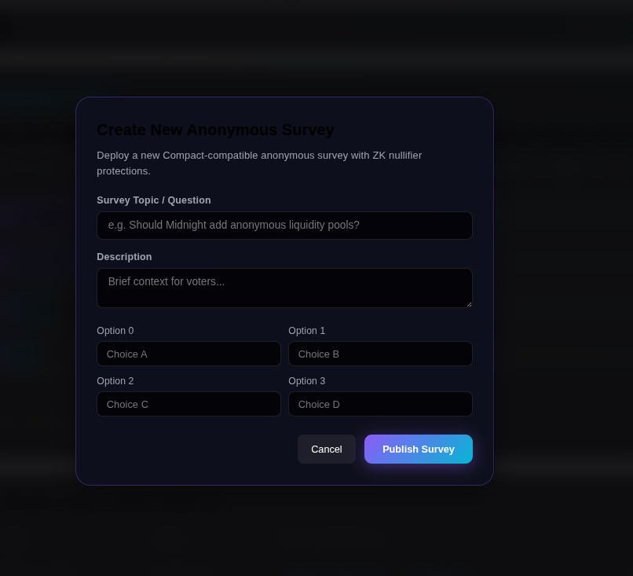
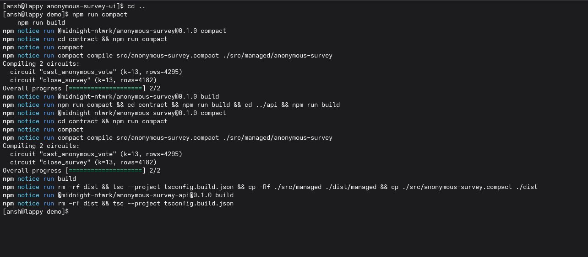

# CipherPoll — Anonymous Survey DApp on Midnight Blockchain

A privacy-preserving, full-stack Zero-Knowledge anonymous survey application built on the Midnight Network using Compact smart contracts and ZK nullifier proofs.

## Contract Address

| Network | Contract Address |
|---------|------------------|
| Preprod | `<YOUR_DEPLOYED_CONTRACT_ADDRESS>` |

```env
CONTRACT_ADDRESS=<YOUR_DEPLOYED_CONTRACT_ADDRESS>
```

## Features

- **Zero-Knowledge Anonymous Polling**: Voters prove voting eligibility and record choices without exposing voter identity.
- **ZK Nullifier Protection**: Poseidon hash-based nullifier `H("anon_survey:nullifier", surveyTag, secret)` prevents double voting on the Midnight ledger.
- **Verifiable Public Tally**: Transparent, on-chain ledger state for public option counters and total vote tallies.
- **Midnight Lace Wallet Connector & ZK Circuit Simulator**: Integrated witness generation and proof execution pipeline via proof-server (`:6300`).
- **Modern High-End Web Interface**: Glassmorphism UI with live vote tally charts and ZK transaction audit log.
- **CLI Tooling**: Command-line interface for deploying, joining, and casting votes.

## What This Project Does

CipherPoll allows organizations, DAOs, and communities to run 100% anonymous polls and surveys on the Midnight blockchain. Voters cast votes through zero-knowledge proofs that guarantee one vote per person while keeping individual selections untraceable to their wallet or real-world identity.

## Privacy Model

- **Public Information**:
  - Active survey status (`ACTIVE` / `CLOSED`).
  - Option vote counts (`option_0_votes`, `option_1_votes`, `option_2_votes`, `option_3_votes`, `total_votes`).
  - Organizer Public Key (`organizer_pk`).
  - Set of used nullifier hashes (prevents double voting).
- **Private Information**:
  - Voter Secret Key (`localVoterSecret` witness).
  - Individual voter identity and wallet address.
- **What Users Prove Without Revealing**:
  - Knowledge of a valid voter secret.
  - Correct execution of circuit logic and nullifier calculation.
  - Selection of a valid option (0-3) without disclosing voter identity.

## Tech Stack

- **Smart Contract**: Compact 0.23 (Midnight Domain Specific Language)
- **ZK Circuit Compiler**: `compact` (v0.5.1 / 0.31.1)
- **Proof Server**: `midnightnetwork/proof-server:latest` (Port 6300)
- **API & Protocol**: `@midnight-ntwrk/midnight-js-protocol`, `@midnight-ntwrk/midnight-js-contracts`
- **Frontend**: React 19, TypeScript, Vite 8, Lucide Icons, Custom Glassmorphism CSS System
- **CLI**: Node.js CLI with `@midnight-ntwrk/testkit-js` and LevelDB private state provider

## Folder Structure

```
demo/
├── contract/
│   ├── src/
│   │   ├── anonymous-survey.compact   # Compact 0.23 smart contract
│   │   ├── witnesses.ts              # ZK witness functions & private state definition
│   │   └── index.ts                  # Compiled contract exports
│   └── package.json
├── api/
│   ├── src/
│   │   ├── common-types.ts           # Types & interfaces for Anonymous Survey API
│   │   ├── index.ts                  # Midnight API wrapper & contract interactions
│   │   └── utils/
│   └── package.json
├── anonymous-survey-cli/
│   ├── src/
│   │   ├── config.ts                 # Preprod/Preview/Standalone network config
│   │   ├── index.ts                  # CLI driver loop & wallet runner
│   │   └── launcher/
│   └── package.json
├── anonymous-survey-ui/
│   ├── src/
│   │   ├── components/               # UI components
│   │   ├── contexts/                 # BrowserDeployedBoardManager & providers
│   │   ├── index.css                 # Midnight dark glassmorphism styling
│   │   ├── App.tsx                   # Main React DApp application
│   │   └── main.tsx                  # Application entrypoint
│   ├── index.html
│   └── package.json
├── images/                           # Application Screenshots
│   ├── dashboard.png
│   ├── zk-proof-modal.png
│   ├── nullifier-audit-log.png
│   └── create-survey.png
├── package.json
└── README.md
```

## Prerequisites

- Node.js >= v22
- Docker Desktop or Docker Engine running
- Compact Compiler (`compact --version`)
- Midnight Lace Wallet Extension (for browser interaction)

## Installation

```bash
npm install
cd api && npm install && cd ..
cd contract && npm install && cd ..
cd anonymous-survey-cli && npm install && cd ..
cd anonymous-survey-ui && npm install && cd ..
```

## Compile

```bash
npm run compact
```

## Build

```bash
npm run build
cd anonymous-survey-cli && npm run build && cd ..
cd anonymous-survey-ui && npm run build && cd ..
```

## Manual Deployment

Deployment is intentionally skipped as per challenge guidelines.

To deploy the Compact smart contract to Midnight Preprod testnet:

```bash
NODE_OPTIONS="--max-old-space-size=12288" npm run deploy -- --network preprod
```

or via CLI:

```bash
cd anonymous-survey-cli
npm run preprod-remote
```

## After Deployment

State clearly that the only remaining manual steps are:

1. Deploy the Compact contract.
2. Copy the deployed contract address.
3. Replace every occurrence of:

```
<YOUR_DEPLOYED_CONTRACT_ADDRESS>
```

No additional coding should be required.

## Environment Variables

- `VITE_NETWORK_ID`: Midnight network ID (`preprod` or `preview`)
- `VITE_LOGGING_LEVEL`: Logging verbosity (`info`, `debug`, `trace`)
- `CONTRACT_ADDRESS`: Deployed contract address placeholder (`<YOUR_DEPLOYED_CONTRACT_ADDRESS>`)

## Screenshots

### 1. DApp Dashboard & Anonymous Survey Feed


### 2. Zero-Knowledge Circuit Execution Modal


### 3. On-Chain Ledger Nullifier Audit Log


### 4. Create New Anonymous Survey Modal


## Initial Idea

Selected from Rise In Midnight Builder Challenge list:
**Idea #27: Anonymous Survey** (`anonymous-survey`)

## Troubleshooting

- **Proof Server Connection Failed**: Ensure Docker container is running:
  `docker run -d -p 6300:6300 midnightnetwork/proof-server:latest`
- **Compact Compiler Missing**: Install globally with `npm install -g @midnight-ntwrk/compact-compiler` or verify PATH.
